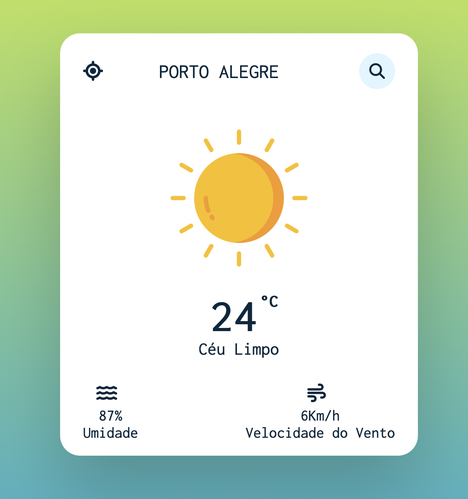

# Aplicação Web de Previsão do Tempo

Uma aplicação web simples e elegante para verificar a previsão do tempo em baseado na sua localização e por busca de cidades.

## Tecnologias Utilizadas :computer:

- HTML5 :orange_book:
- CSS :art:
- JavaScript :yellow_heart:

## Demonstração :link:

Confira a aplicação em ação:
- [Ver Previsão do Tempo](https://bernardo-zamin.github.io/Previsao-do-Tempo/)

## Autor :bust_in_silhouette:

Desenvolvido por [Bernardo Zamin](https://github.com/Bernardo-Zamin)
